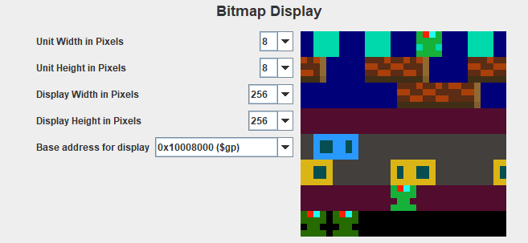

# frogger

 An implementation of the frogger arcade game in MIPS assembly. Runs in the MARS 4.5 IDE (included).

 To play the game:
<ol>
  <li>Open frogger.asm in MARS, under tools, connect Keyboard and Display MMIO Simulator to MIPS and connect the Bitmap Display to MIPS with the following configuration:
  <ol>
  <li>Unit width in pixels: 8</li>
  <li>Unit height in pixels: 8</li>
  <li>Display width in pixels: 256</li>
  <li>Display height in pixels: 256</li>
  <li>Base Address for Display: 0x10008000 ($gp)</li>
</ol></li>
  <li>Assemble and run the game.</li>
  <li>In Keyboard and Display MMIO Simulator, use "wasd" to move, "p" to toggle pause, "r" to restart, and "q" to quit.</li>
</ol>